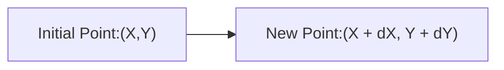

We are going to learn about how to calculate the price of two tokens in an AMM. Let's say we have an AMM with two tokens: X and Y. The current amount of each token in the pool is represented by a point on a graph.

The point (X,Y) is on a curve that represents the total value of the pool. The slope of the tangent line to this curve at the point (X,Y) represents the price of token X in terms of token Y.

We can imagine that we do a swap on this AMM. A swap is an exchange of one token for another.

We start by putting in a small amount of token X, represented by dX. The AMM will then give us back a corresponding amount of token Y, represented by dY.

We can use the slope of the line that connects the initial point (X,Y) and the new point (X + dX, Y + dY) to calculate the price of token X in terms of token Y.

The slope of this line is dY / dX. We can see that as dX gets smaller, the slope of this line will get closer to the slope of the tangent line. This is because the line connecting the two points becomes a better approximation of the tangent line as dX gets smaller.

So, the price of token X in terms of token Y is given by the slope of the tangent line to the curve at the point (X,Y).

##  Diagram

### Initial Point: (X,Y)

### New Point: (X + dX, Y + dY)

This diagram represents the swap we described above. The initial point is (X,Y), and the new point is (X + dX, Y + dY). 
