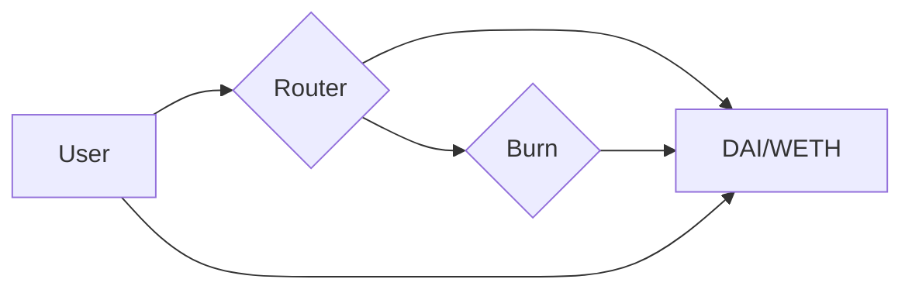

## Remove Liquidity

We're going to look at how to remove liquidity from a Uniswap V2 pair contract.

In Uniswap V2, when we add liquidity, we are essentially minting pool shares which are represented by an ERC20 contract. 

To remove liquidity, we will need to call the `removeLiquidity` function on the Uniswap V2 Router contract. 

For example, we will remove liquidity from the DAI/WETH pair contract.

When we call `removeLiquidity`, the router will first call `transferFrom` to move our pool shares from our wallet to the pair contract. 

Before we can call `removeLiquidity`, we need to approve the Router contract to spend our pool shares. 

After transferring the pool shares to the pair contract, the router will call the `burn` function on the pair contract which will burn the pool shares we provided. This will then transfer WETH and DAI back to us.

## Diagram

