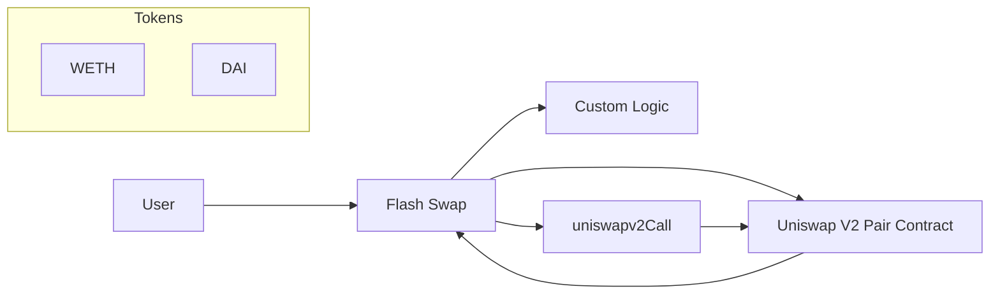

## Flash Swap

We'll go over an example of how flash swaps work.

Let's say we have a user who wants to perform a flash swap on the Uniswap V2 DAI/WETH pair. This involves interacting with a flash swap smart contract and the Uniswap V2 pair contract.

The user initiates the flash swap by calling a function inside the flash swap smart contract. The flash swap contract then calls the `swap` function on the Uniswap V2 pair contract.

The Uniswap V2 pair contract sends the requested amount of tokens (both DAI and WETH) to the flash swap contract simultaneously.

The flash swap contract can then perform any custom logic using the borrowed tokens. For example, we can execute an arbitrage opportunity. After executing our custom logic, we need to repay the borrowed tokens plus any fees. This is done by calling the `uniswapv2Call` function inside the flash swap contract.

The Uniswap V2 pair contract verifies that the flash swap contract has repaid the borrowed tokens and fees. If successful, the transaction is completed. If the repayment is not correct, the `swap` function reverts, failing the transaction.

**Diagram:**

This process of borrowing and repaying tokens within the same transaction allows for efficient arbitrage opportunities. 
