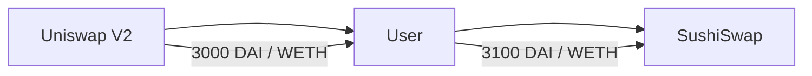
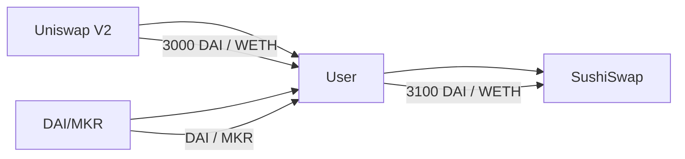

## Uniswap V2 Arbitrage

In this lesson, we will be exploring how we can perform arbitrage with Uniswap V2 contracts. Arbitrage is the process of taking advantage of price differences between two exchanges. Essentially, you buy the asset on the exchange with the lower price and sell it on the exchange with the higher price. This can be a very profitable strategy but is also very risky.

We will look at two ways we can do this:

1. With capital
2. With Flash Swaps

Let's say that we have two Uniswap V2 contracts. The first contract is Uniswap V2. The second contract is a fork of Uniswap V2 called SushiSwap.

On Uniswap, let's say 1 WETH is selling for 3000 DAI. On SushiSwap, 1 WETH is selling for 3100 DAI. This means that there is an arbitrage opportunity. A user can buy WETH on Uniswap and then sell it on SushiSwap for a profit.

Here is a diagram of the arbitrage opportunity:



To execute this arbitrage, the user would need to have DAI to begin with. But what if the user did not have any DAI? 

We can borrow DAI from somewhere else.

For example, let's say there is another Uniswap V2 pair called DAI/MKR. Flash Swaps allow other smart contracts to borrow tokens as long as the token and a fee are paid back in the same transaction.

Here is a diagram of how the arbitrage would work using a flash swap:



We can use the flash swap to borrow DAI from the DAI/MKR Uniswap V2 pair contract, execute the arbitrage, and then repay the flash swap.

Now, let's look at how we can calculate the profit for this arbitrage. The basic idea is to subtract the DAI that came out, minus the DAI that went in, and then minus all of the fees.

Let's say the user borrowed 3000 DAI from the flash swap and put in one WETH, getting back 3100 DAI from SushiSwap. The Flash Swap fee is 9 DAI, and the gas fee is 20 DAI.

Here is a breakdown of the profit calculation:

```
Profit = DAI out - DAI in - DAI flash swap fee - gas fee
Profit = 3100 - 3000 - 9 - 20
Profit = 71 DAI
```

This means that the user would make a profit of 71 DAI after executing this arbitrage.

In this lesson, we have learned how to perform arbitrage with Uniswap V2 contracts, including how to use Flash Swaps to borrow capital. We also learned how to calculate the profit for an arbitrage opportunity. 
