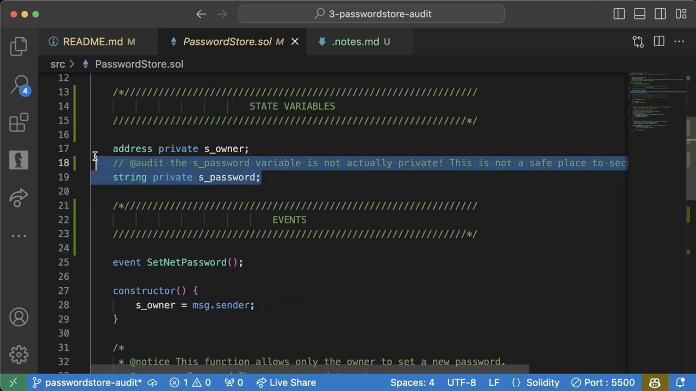

_Follow along with this video:_

<iframe width="560" height="315" src="https://www.youtube.com/embed/gEqNT-2JfXM?si=sFK1Xaxm6BPWZTWm" title="YouTube video player" frameborder="0" allow="accelerometer; autoplay; clipboard-write; encrypted-media; gyroscope; picture-in-picture; web-share" allowfullscreen></iframe>

---

# The In-depth Guide to Code Reconnaissance

In the exciting field of programming, the process of code reconnaissance plays a crucial role. Delving into a new code base can be daunting, whether it's your project or someone else's. But fear not, this lesson aims to guide you through diverse techniques and tools you can utilize to make sense out of a new codebase.

We'll go through recon steps such as:

- Checking README instruction
- Reviewing contract scope
- Examining essential code functions
- Testing and coverage checks

Ready to dive in? Let's start!

## _README_ Instructions: Where It All Begins

The _README_ file is the launchpad for your process of understanding any new codebase. It usually includes essential commands you can execute, and in our case, we have: `make anvil`, `make deploy`, `forge test`, and `forge coverage`.

These provide a good starting point but we won't stop here. We might want to further scrutinize, say, the deploy function to ensure its validity.

> **Note:** While sticking to the README allows you to understand the core functionalities, don't forget to step out of it and explore unknown territories.

## Diving into Contract Scope

The most fundamental step is to get a grasp of the contract's scope. Analyze it thoroughly, then rinse and repeat till you're confident with its functionality. The more you explore, the higher the chance of spotting a loophole!

### Ask Questions. A Lot of Them!

Through your investigation, a lot of queries might pop up. Ask them all! Are you using the correct compiler version? Went through all possible functionalities? No question is a bad question. The right questions can lead you to inherent vulnerabilities that might've been overlooked.

With our codebase, we were successful in answering all the puzzles, helping us understand the code better and potentially spotting some vulnerabilities.

## Testing and Coverage

Once you are through with the code's understanding, the next step is to dive into code testing. You might want to run `forge test` to evaluate the test coverage of the code base.

Prior to this, ensure you've run a code build to know how many tests exist and perhaps peek into the test folder to understand more about existing tests.

> **Pro Tip:** It's advisable to look for whether every potential scenario has a corresponding test.

For example, in our codebase, two tests existed - `test owner can set password` and `test non owner reading password reverts`. However, we found no test ensuring that a non-owner can't set the password.

This indicated a lack of comprehensive test coverage, possibly leading to unidentified vulnerabilities.

## Vanity Metric?: Deciphering Code Coverage

Conducting an analysis via `forge coverage` could offer insights into the code coverage. Yet, it's important to remember that coverage can sometimes be a hollow indication of code quality.

For instance, even though our code reported a 100% coverage, we were able to discover significant vulnerabilities. Simply, anyone could set or read the password. Furthermore, we found misleading documentation.

## Finalises Code Audit

Once you've gathered all your findings, it's time to do a final review of your audit. In our case, we identified three major issues that need an elaborate write up.

Running a quick search for "@audit" would list down all issues identified. This is your final chance to ensure nothing slips through the cracks.

In conclusion, code reconnaissance is a step-by-step, detailed process that involves careful understanding, thorough checks, and comprehensive testing. Always remember, the more in-depth you delve, the more efficient your code audit would be.
